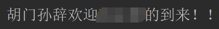

# 项目介绍

这个项目开始于我研一新入学时，最初是一个exe格式的宿舍抢订系统，但许多人不会使用。现在，在我即将毕业之际，我终于将它改写为Python版本。

**经过三年的时间，西安电子科技大学的这个小工具已经经历了多次迭代。**

## 功能介绍

- **登录算法**：已实现基本的登录功能。
- **抢宿舍**：用户需要自行添加POST请求来实现。
- **选课系统**：同上，通过添加相应的POST请求来完成选课。
- **监控盲审**：检查盲审结果是否完成，需要用户自行实现。
  **监控球场空缺**：监控球场预约或其他预约。

## 使用说明

1. 安装必要的库。
2. 修改文件中的学号和密码。
3. 运行脚本。

### 登录成功

当你正确地设置了学号和密码，并成功运行了脚本，你应该会看到如下的登录成功界面：

### 登录失败

如果登录失败（可能是由于密码错误，网络问题或其他配置错误），你将看到以下界面：

## 开发背景

此项目旨在帮助新入学的研究生解决选宿舍、选课及监控盲审的问题。一个好的宿舍对于学生的日常生活影响重大，选课同样关系到学习进程的顺利进行。

## 注意事项

- **日期**：2024年4月16日，项目确保可以运行。其他时间效果自行评估。
- **声明**：项目仅供学习交流使用，请勿用于任何违法用途。

## 加入我们

欢迎加入**胡门安全**，成为攻防技术的一员，我们期待你的加入！

